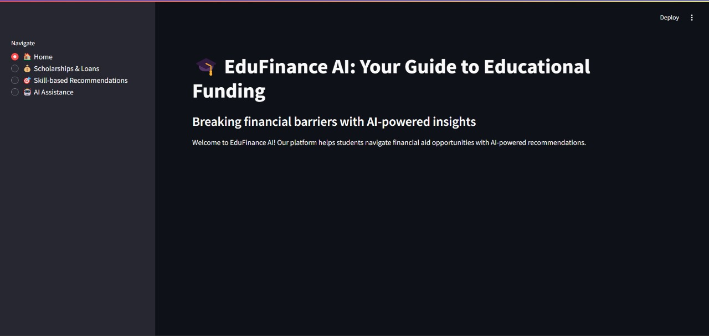
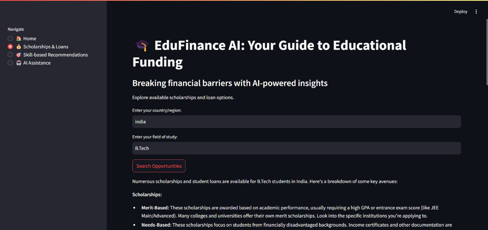
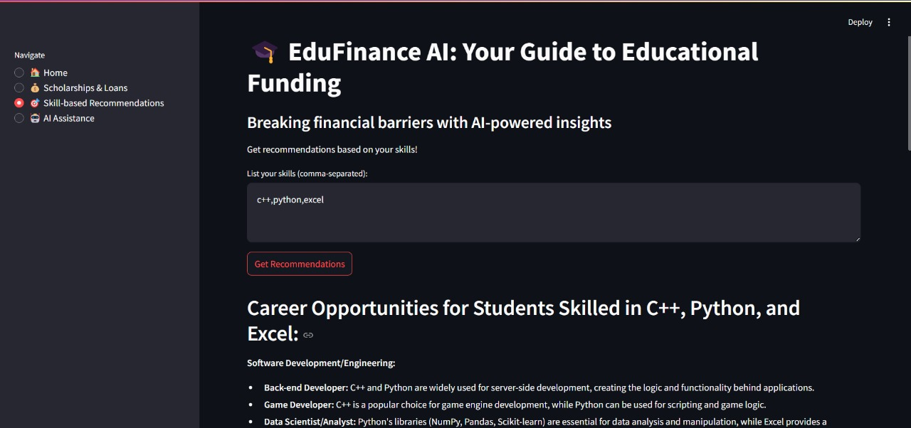

# EduFinance AI 🎓💰
> Breaking financial barriers with AI-powered insights for educational funding


## 🚀 Overview

EduFinance AI is an innovative solution addressing financial barriers in education by providing personalized scholarship and loan recommendations using AI. The platform helps students from lower-income families discover funding opportunities tailored to their skills, field of study, and location.

## 🌐 Live Demo  
🎓 [Try EduFinance AI Here!](https://edufinance-ai.streamlit.app/) 

## 📌 Problem Statement

Many students from lower-income families face financial challenges in paying school/college fees, especially post-COVID. These barriers lead to:
- Increased dropout rates
- Limited access to learning resources
- Restricted academic/career opportunities
- Perpetuation of poverty cycles

## 💡 Our Solution

EduFinance AI provides:
- AI-powered scholarship/loan discovery
- Skill-based opportunity matching
- Personalized financial guidance
- Accessible interface for all students

## 🛠 Technologies Used

- Python 3.x
- Streamlit (Web Interface)
- Google Gemini API (AI Backend)
- Dotenv (Environment Management/Data Security)

## 📸 Demo  

 
 
 

## 🏃‍♂ Getting Started

### Prerequisites
- Python 3.8+
- Google Gemini API key

1. Clone the repository:
   ```bash
   git clone https://github.com/sonalimahato/EduFinance-AI.git
   cd EduFinance-AI
   ```
1. Install dependencies:  
   ```bash
   pip install -r requirements.txt
   ```
2. Run the app:  
   ```bash
   streamlit run app.py
   ```